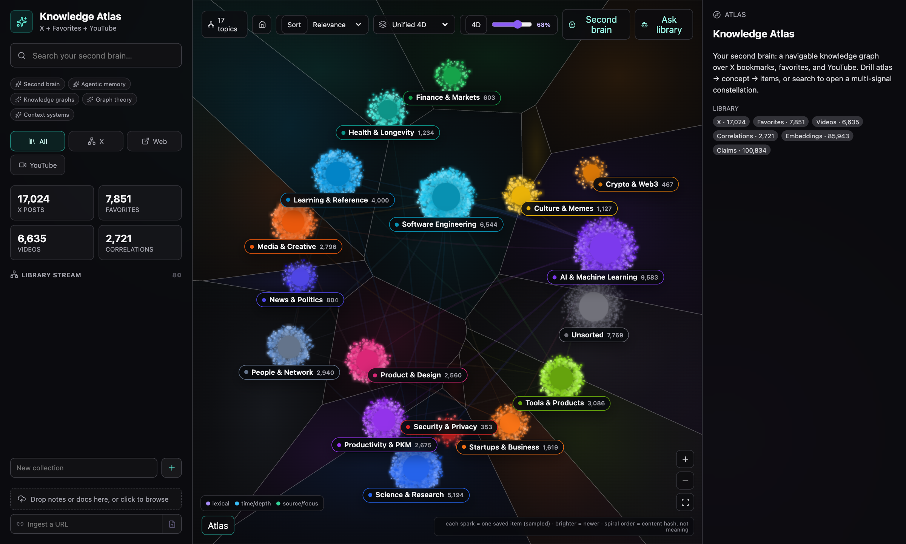
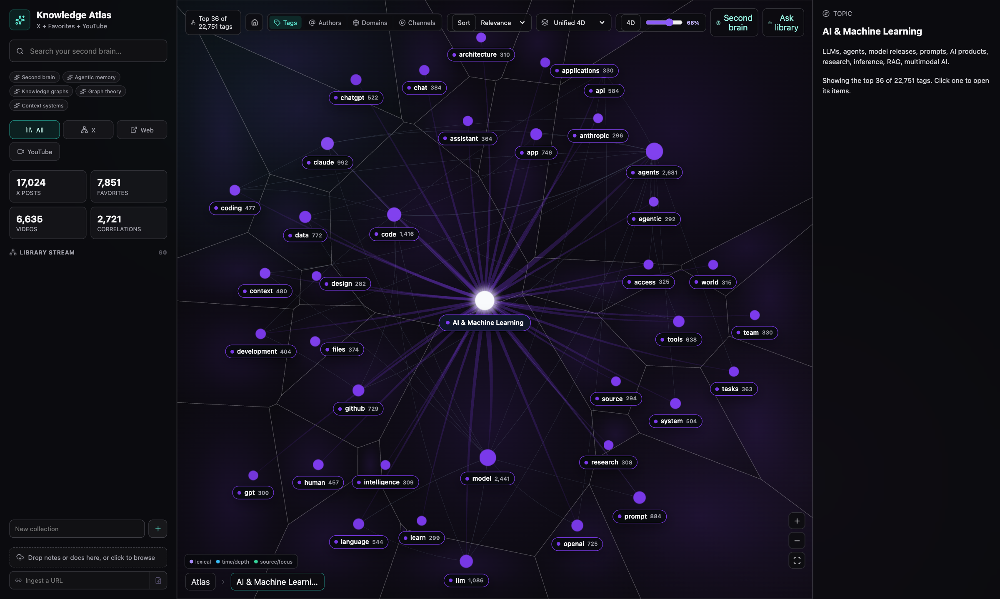
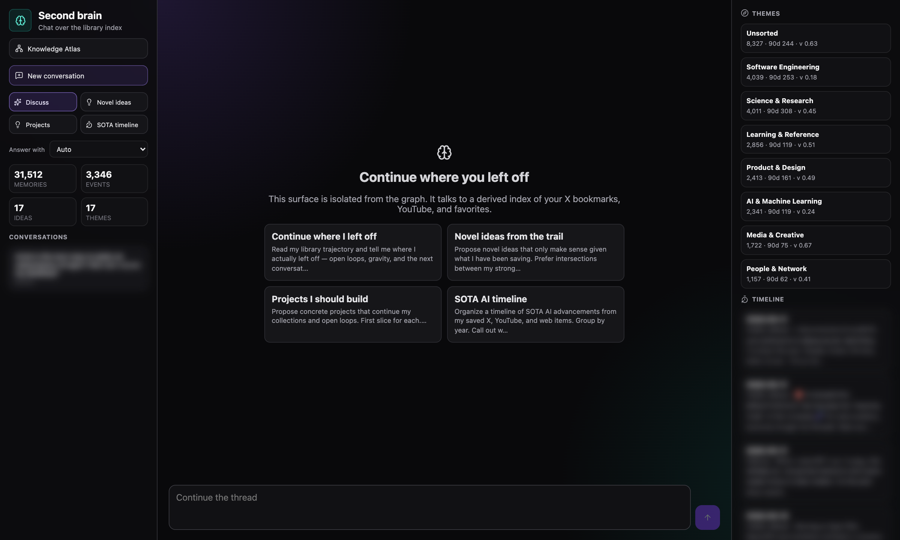

# Knowledge Atlas

A local-first knowledge graph and second-brain assistant for everything you save: **X bookmarks, YouTube playlists, browser bookmarks, and documents**. It crawls your own libraries into a single SQLite database, enriches them (linked articles, image descriptions, topics, tags, embeddings), and gives you a navigable atlas, hybrid semantic search, and a chat assistant grounded in what you actually saved.

Everything runs on your machine. No cloud account is required; LLM features are optional and pluggable.



| Topic drill-down | Second-brain assistant |
|---|---|
|  |  |

## What it does

- **Collect.** Playwright crawlers read your X bookmarks and YouTube playlists through your own signed-in browser session. Browser bookmark exports (Chrome, Edge, Firefox, Safari) and documents (Markdown, PDF, Word, Excel, URLs) import directly.
- **Enrich.** Fetches and summarizes linked articles, describes images, assigns topics and tags, and embeds every item with a local MiniLM model (no API needed).
- **Explore.** A three-level atlas (topics → categories → items) with non-overlapping labels, a free-form correlation graph, collections, and soft archive/remove.
- **Search.** Hybrid lexical + semantic ranking with recency, graph centrality, and diversity (MMR), with a transparent "why" for each result.
- **Ask.** Q&A over your library through the `claude`, `codex`, or `grok` CLI, with retrieved context passed over stdin.
- **Second brain.** A separate assistant index (`data/assistant.db`) that mirrors the catalog read-only and derives themes, a dated AI timeline, idea seeds, and open threads from *your* library, then chats with you about them.

## Quick start

Requirements: Node.js 20+, and optionally Python 3 with `yt-dlp` for YouTube transcripts.

```bash
git clone https://github.com/scalabled/knowledge-atlas.git
cd knowledge-atlas
npm install
npx playwright install chromium
cp .env.example .env
```

Collect your X bookmarks. The first run opens a browser window; sign in to X once and the crawl starts:

```bash
npm run crawl:x
```

Then enrich, embed, index, and open the app:

```bash
npm run enrich            # linked pages, media, topics, tags, graph
npm run embed:real        # local MiniLM embeddings for semantic search
npm run assistant:index   # second-brain index (read-only over the catalog)
npm run dev               # http://127.0.0.1:5173
```

[docs/USING-YOUR-OWN-DATA.md](docs/USING-YOUR-OWN-DATA.md) walks through every source, incremental updates, and customization.

## Sources

| Source | Command | Notes |
|---|---|---|
| X bookmarks | `npm run crawl:x` | Incremental: add `-- --stop-after-existing-pages 3` to stop once it reaches bookmarks you already have |
| YouTube playlists | `npm run crawl:youtube` | Watch Later by default; set `XBG_YOUTUBE_PLAYLISTS=WL,PLxxxx=Name` for more |
| YouTube transcripts | `npm run youtube:transcripts -- --ids ID1,ID2` | Uses `yt-dlp`, falls back to `youtube-transcript` |
| Browser bookmarks | `npm run import:favorites -- --source bookmarks.html` | Any Netscape-format HTML export |
| Documents | Drag and drop in the app, or `POST /api/ingest` | Markdown, text, PDF, DOCX, XLSX, PPTX, URLs |
| Siftly | `npm run import:siftly -- --source path/to/dev.db` | Imports an existing Siftly bookmark database |

## Browser support

The crawlers work in three modes, set with `XBG_BROWSER` in `.env` or `--browser` per run:

| Mode | How it signs in | Platforms |
|---|---|---|
| `chromium` (default) | Playwright's bundled Chromium with its own profile in `./profiles`. Sign in once in the window it opens. | macOS, Windows, Linux |
| `chrome` | Clones your signed-in Google Chrome profile. Chrome can stay open. | macOS, Windows, Linux |
| `edge` | Clones your signed-in Microsoft Edge profile. Edge can stay open. | macOS, Windows, Linux |

Pick a non-default profile with `--browser-profile "Profile 1"` (the folder name shown at `chrome://version`). If a cloned profile doesn't carry your session, run once with `--browser chromium` and sign in; that profile persists.

## Second-brain assistant

```bash
npm run assistant:index                       # refresh after each crawl
npm run assistant:query -- "where did I leave off"
npm run assistant:chat -- --mode project "what should I build next?"
```

In the app, click **Second brain** (or open `/#assistant`). Modes: Discuss, Novel ideas, Projects, SOTA timeline. Chat can answer with any of these providers, chosen in the UI, with `--provider`, or with `XBG_ASSISTANT_PROVIDER`:

| Provider | Setup |
|---|---|
| `xai` | `XAI_API_KEY` in `.env` (supports tool calls against the index) |
| `claude` | [Claude Code](https://claude.com/claude-code) CLI on `PATH` |
| `codex` | OpenAI Codex CLI on `PATH` |
| `grok` | Grok Build CLI on `PATH` (or `~/.grok/bin`) |

`auto` (the default) picks xAI when keyed, else the first CLI it finds. With none available, the assistant still returns a grounded retrieval briefing. Details: [docs/ASSISTANT.md](docs/ASSISTANT.md).

## Build your own

Want this for a different library, such as Pocket, Raindrop, GitHub stars, Readwise, Reddit saves, or Kindle highlights? Point a coding agent at this repo with the prompt in [BUILD-YOUR-OWN.md](BUILD-YOUR-OWN.md). It explains the architecture contract, the pieces to keep, and the pieces to swap.

## Architecture

```
src/
  lib/        shared: db schema, env, types, LLM CLI runner, X normalizer
  pipeline/   crawl, import, enrich, classify, embed, graph rebuild (CLI)
  assistant/  isolated second-brain index + chat (writes only assistant.db)
  server/     Express API: explore, hybrid search, ask, assistant
  web/        React + Sigma WebGL atlas, graph, and assistant UI
```

[ARCHITECTURE.md](ARCHITECTURE.md) is the full guide for humans and agents: data model, pipelines, API, ranking, layout, and invariants.

```bash
npm run check   # TypeScript
npm test        # layout, ranking, assistant tests
```

## Privacy and terms

- Your data never leaves your machine unless you enable an LLM provider. Retrieved snippets are then sent to that provider.
- `data/`, `profiles/`, and `.env` are gitignored. Never commit them: they contain your library and browser session cookies.
- The X and YouTube crawlers automate *your own* signed-in browser to read *your own* saved items. Automated access may conflict with those platforms' terms of service. Use it at your own risk, keep the default delays, and don't redistribute other people's content.

## Backups

SQLite runs in WAL mode; take consistent backups with:

```bash
stamp=$(date +%Y%m%d-%H%M%S)
sqlite3 data/bookmarks.db ".backup 'data/backups/bookmarks-$stamp.db'"
sqlite3 data/backups/bookmarks-$stamp.db 'PRAGMA integrity_check;'
```

## License

[MIT](LICENSE)
